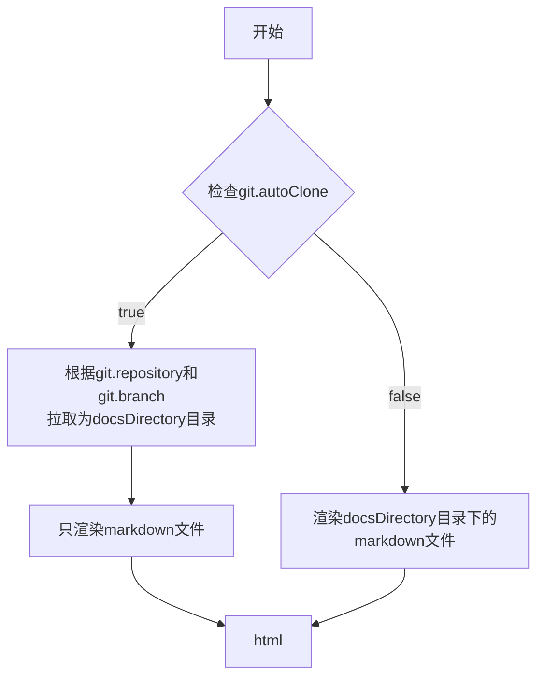

<div align="center">

# SimpleDocs

**演示地址: [SimpleDocs](https://simpledocs.endlesssolo.com/)**

简单的静态文档（Markdown -> HTML）网站生成器，基于 Vue 3 + Vite 构建。

中文 | [English](./README_EN.md)

</div>

## 功能

- 基本的Markdown语法支持
- 侧边栏树导航、目录、搜索（基于 rss.xml）
- Mermaid / Chart.js / MathJax支持
- 自动获取 Git 仓库文档并渲染
- 支持界面主要内容的国际化（i18n）切换

## 待完成

- [x] Markdown 页内相对路径链接跳转
- [ ] 左侧菜单自定义排序
- [ ] 上一篇/下一篇跳转
- [ ] 添加文件 Git 修改历史查看（？）

## 配置

配置文件: `docs.config.json`

```json
{
  "title": "",
  "language": "",
  "url": "",
  "description": "",
  "docsDirectory": "",
  "git": {
    "autoClone": true,
    "repository": "http://192.168.31.210:3000/rightdoor/testwiki.git",
    "branch": "dev",
    "timeOut": 60000,
    "showInfo": true,
    "edit": true
  },
  "homepage": "",
  "favicon": "",
  "defaultTheme": ""
}
```

- title：网站标题/meta 标题
- language：为空默认：`zh-CN`。可自行添加其他语言，例如：添加src/locales/en-US.json，则此处填写en-US
- url：网站 URL，例如：`https://example.com`，为空则为相对路径
- description：知识库描述/meta 描述
- docsDirectory：文档目录，默认：`docs`（相对路径且不要使用`/`开头）
- git：Git 配置
  - autoClone：是否自动克隆 Git 仓库，为空默认：`false`
  - repository：Git 仓库地址，例如：`https://github.com/user/repo.git`，且必须是公开仓库，否则会导致构建失败
  - branch：Git 分支，为空默认：`main`
  - timeOut：Git 操作超时时间，为空默认：`60000`（单位：毫秒）
  - showInfo：是否显示 Git 仓库信息，为空默认：`true`
  - edit：是否启用编辑链接，为空默认：`true`
- homepage：首页文档路径，默认：`docs/README.md`
- favicon：网站图标路径，默认：`public/favicon/logo.webp`
- defaultTheme：默认主题，可选：`auto`、`dark`、`light`，默认：`auto`

## 运行流程



## 开发

```bash
pnpm install
pnpm dev
```

## 构建

```bash
pnpm build
pnpm preview
```

## ⭐感谢阅读到最后⭐

创建这个项目的目的是为了能够快速、方便地创建一个静态 Markdown 文档网站，方便自己在内网查看自己写的笔记。在构思的过程中也使用了许多静态文档生成器，感觉都不是很符合自己的需求，所以就自己写了一个。

如果你觉得这个项目不错，请给个 Star 吧！

本项目采用 MIT 许可证开源，您可以在遵守协议的前提下自由使用、修改和分发本项目的代码。

***注意：本项目使用部分 AI 辅助生成部分代码，以及 AI 注释功能进行辅助开发。***
