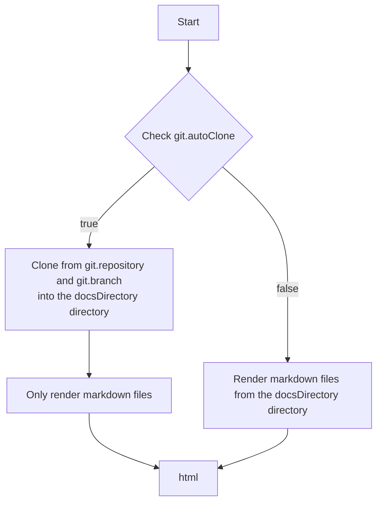

<div align="center">

# SimpleDocs

**Demo: [SimpleDocs](https://simpledocs.endlesssolo.com/)**

A simple static documentation (Markdown -> HTML) website generator built with Vue 3 + Vite.

[中文](./README.md) | English

</div>

## Features

- Basic Markdown syntax support
- Sidebar tree navigation, table of contents, search (based on rss.xml)
- Mermaid / Chart.js / MathJax support
- Automatically fetch and render documents from a Git repository
- Support for switching the main interface content's internationalization (i18n)

## To-Do

- [x] Relative path link navigation within Markdown pages
- [ ] Custom sorting of left menu
- [ ] Previous/Next page navigation
- [ ] Add file Git revision history view (?)

## Configuration

Configuration file: `docs.config.json`

```json
{
  "title": "",
  "language": "",
  "url": "",
  "description": "",
  "docsDirectory": "",
  "git": {
    "autoClone": true,
    "repository": "http://192.168.31.210:3000/rightdoor/testwiki.git",
    "branch": "dev",
    "timeOut": 60000,
    "showInfo": true,
    "edit": true
  },
  "homepage": "",
  "favicon": "",
  "defaultTheme": ""
}
```

- title: Website title / meta title
- language: If empty, default: `zh-CN`. You can add other languages yourself, e.g., add src/locales/en-US.json, then fill in en-US here.
- url: Website URL, e.g., `https://example.com`. If empty, uses relative path.
- description: Knowledge base description / meta description
- docsDirectory: Document directory, default: `docs` (relative path and do not start with `/`)
- git: Git configuration
  - autoClone: Whether to automatically clone the Git repository, if empty default: `false`
  - repository: Git repository address, e.g., `https://github.com/user/repo.git`, must be a public repository, otherwise the build will fail.
  - branch: Git branch, if empty default: `main`
  - timeOut: Git operation timeout, if empty default: `60000` (in milliseconds)
  - showInfo: Whether to display Git repository information, if empty default: `true`
  - edit: Whether to enable edit link, if empty default: `true`
- homepage: Homepage document path, default: `docs/README.md`
- favicon: Website icon path, default: `public/favicon/logo.webp`
- defaultTheme: Default theme, options: `auto`, `dark`, `light`, default: `auto`

## Workflow



## Development

```bash
pnpm install
pnpm dev
```

## Build

```bash
pnpm build
pnpm preview
```

## ⭐Thank you for reading to the end!⭐  

The purpose of creating this project is to quickly and easily generate a static Markdown documentation website, making it convenient to view my own notes on an intranet. During the planning process, I tried out several static site generators, but none of them fully met my needs, so I decided to build my own.  

If you find this project useful, please give it a Star!  

This project is open-sourced under the MIT License, allowing you to freely use, modify, and distribute the code in compliance with the license.  

***Note: Some parts of this project were generated with the assistance of AI, and AI-powered comment features were used during development.***
